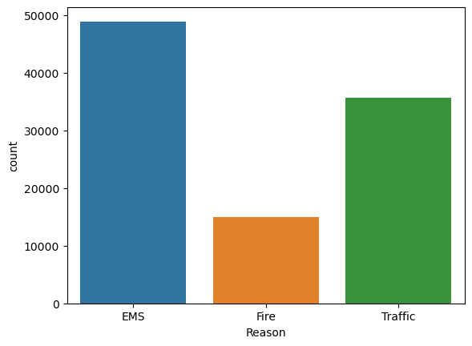
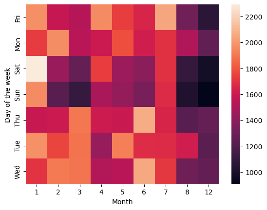
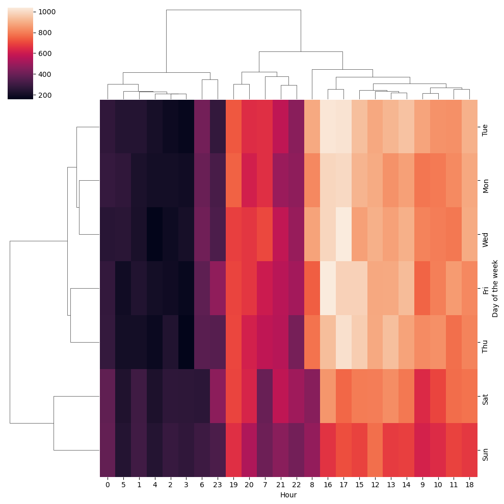

# Introduction
🚨 **911 Calls Data Analysis Project** 
This project analyzes a dataset of 911 emergency calls to uncover patterns and trends in call volume, types of emergencies, and geographical hotspots. It leverages data visualization techniques to highlight key insights about when and where emergencies are most common.

📊 **Explore the dataset:** Visualizations include analysis by time, location, and type of emergency to offer a deeper understanding of the data.
# Background
### The questions this project aims to answer:
1. What are the most common types of emergencies reported in the 911 calls? 
2. What is the trend of call volume over time (by year, month, day, etc.)? 
3. Are there any geographical hotspots for different types of emergencies? 
4. How do call patterns vary by day of the week or time of day?
# Tools I Used
To analyze the 911 call data, I used several key tools:

- Pandas: For data manipulation and analysis, making it easy to load and clean the dataset. 
- Seaborn & Matplotlib: To create a range of visualizations, including bar plots, heatmaps, and cluster maps, providing a clear view of the trends. 
- Numpy: For numerical operations and handling array data. 
- Jupyter Notebook: To execute the analysis and display visualizations.
# The Analysis
This project’s analysis is split into several sections:

### 1. Call Volume by Time
We analyzed the call volume by different time periods—day of the week, month, and year. Bar plots and heatmaps were used to reveal peak times for emergencies.

### 2. Types of Emergencies
By categorizing the types of 911 calls (medical, fire, traffic), we could determine the most frequent emergencies reported. Cluster maps helped in visualizing patterns.

### 3. Geographical Distribution
Mapping the geographical distribution of calls highlighted areas with the highest call volumes. Specific patterns were identified by analyzing calls at the township level.

### 4. Clustering Analysis
A clustering approach was used to group data by different time intervals (e.g., day of the week, month) and identify trends in call frequency.
# Conclusions
#### Key Insights: 
### 1. Common Types of Emergencies
- The analysis revealed that medical emergencies accounted for the majority of 911 calls, followed by traffic-related incidents and fire emergencies.

### 2. Temporal Patterns in 911 Calls
- Calls were shown to spike during certain months, with summer months experiencing a higher volume of calls.
- Day-of-the-week analysis highlighted that weekends have a noticeably lower call volume, while Mondays tend to see an early-week spike.

### 3. Call Volume by Time of Day
- Most calls were made during late afternoon and early evening hours (around 4-6 PM), likely reflecting peak traffic times and other afternoon activities.

### 4. Geographical Hotspots
The township analysis identified a few areas with consistently higher call volumes. These are possible resource allocation hotspots.
- Top 5 townships:

| Township      | Number of Calls |
|---------------|-----------------|
| LOWER MERION  | 8443            |
| ABINGTON      | 5977            |
| NORRISTOWN    | 5890            |
| UPPER MERION  | 5227            |
| CHELTENHAM    | 4575            |

# Closing Thoughts
This project provided a comprehensive look into emergency call data, offering valuable insights into the patterns and trends of 911 calls. Analyzing and visualizing these trends helped me reinforce key data analysis techniques, particularly in managing large datasets and effectively communicating findings through visualizations.

Overall, it was a rewarding experience that not only enhanced my technical skills but also deepened my understanding of how data can be used to inform decision-making in critical services like emergency response. I look forward to applying these insights to more complex datasets and continuing to refine my data analysis approach.

